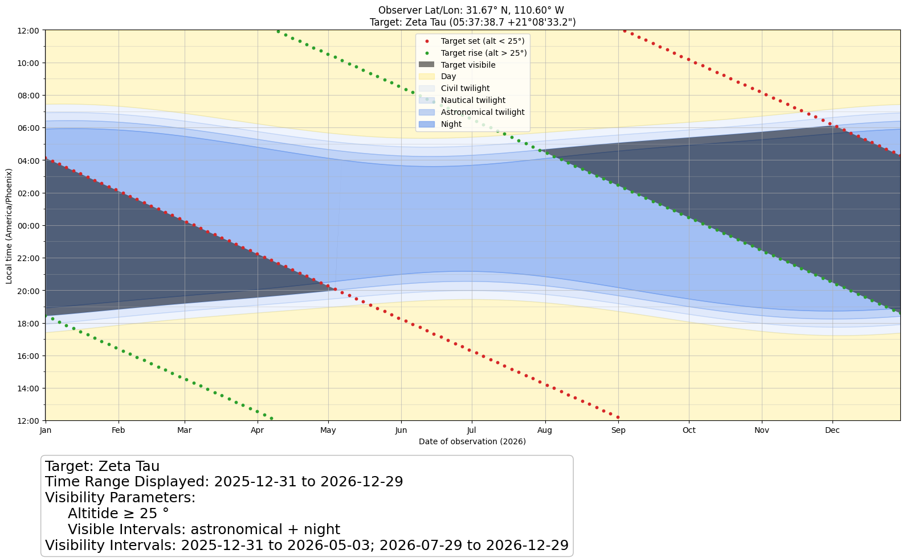
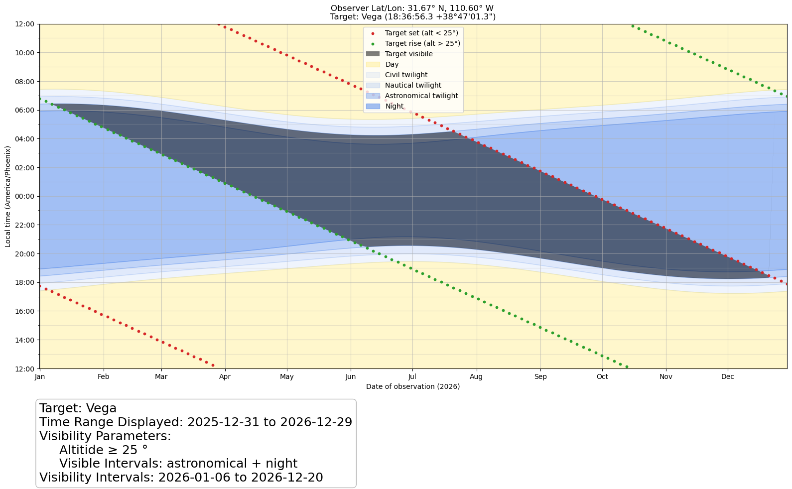
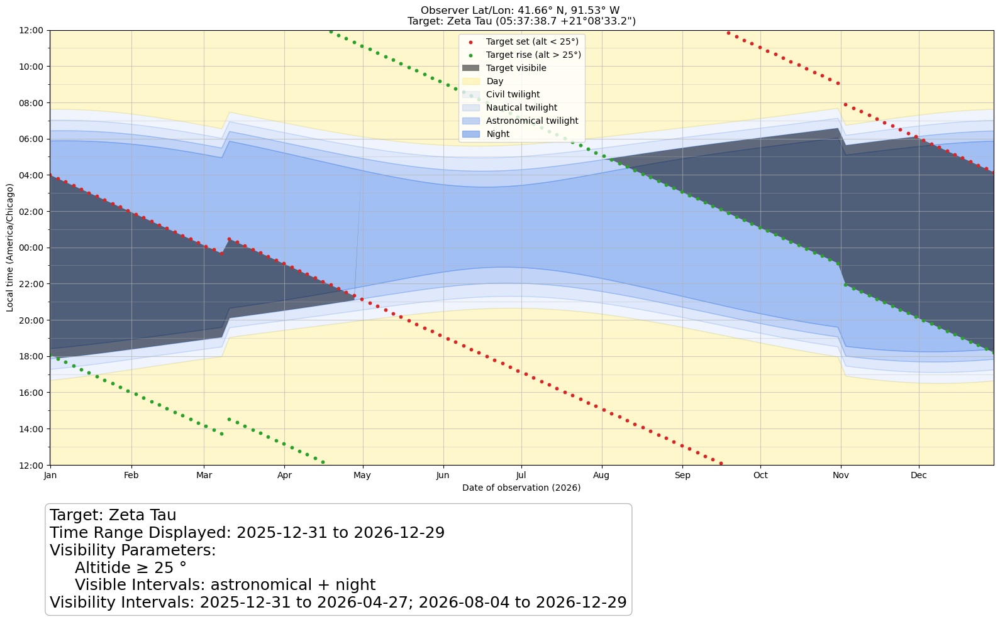

# Visibility Planner

## Overview

**Visibility Planner** is a tool for computing and visualizing when an astronomical target is observable from a given location. It generates plots showing **time of year (x-axis)** vs **local time (y-axis)** and highlights the regions where:

* the target is **above a minimum altitude**, and
* it is **nighttime**

This makes it easy to quickly identify optimal observing windows throughout the year.

---

## Example Plots

### 1. Visibility of a target from Winer Observatory

This plot shows the visibility window for a target as seen from Winer Observatory in Arizona. The highlighted regions indicate when the target is both above the horizon and the sky is dark.

---

### 2. Changing the target (different RA/Dec)

Here we select a different target. Because it has a different right ascension and declination, its visibility shifts to different times of the year compared to the first example.

---

### 3. Changing the observer location

In this example, we return to the original target but change the observing location. Several effects are visible:

* The local time axis now reflects **daylight savings time**, unlike the first location
* The target is **visible for a shorter duration**
* **Nighttime is shorter in the summer**, since this location is farther from the equator

---

## Summary

This tool provides an intuitive way to explore how both **target coordinates** and **observer location** affect observability, making it useful for planning observations across different sites and seasons.
